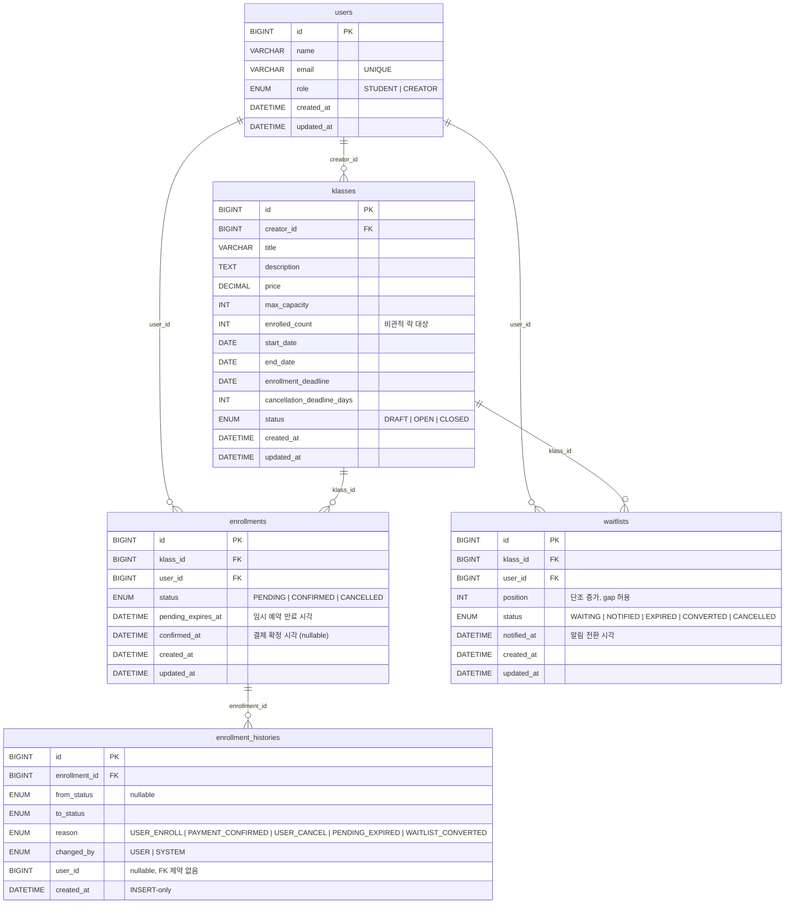

# liveKlass — 수강 신청 시스템

## 프로젝트 개요

강의 개설부터 수강 신청, 결제 확정, 대기열 관리까지 처리하는 백엔드 시스템입니다.

크리에이터(강사)는 강의를 개설하고 정원/가격/기간을 설정합니다.
수강생은 원하는 강의를 신청하고 결제를 완료하면 수강이 확정됩니다.
정원이 이미 찼다면 대기를 등록해두고, 자리가 생겼을 때 순번대로 알림을 받아 20분 내에 수락할 수 있습니다.

**선택 구현 현황**

| 선택 항목 | 구현 여부 |
|-----------|-----------|
| 수강 취소 가능 기간 제한 | 강의 시작일 기준 N일 전까지 (크리에이터 설정, 기본 7일) |
| 대기열(Waitlist) | WAITING → NOTIFIED → CONVERTED/EXPIRED, 순번 보장 |
| 강의별 수강생 목록 | `GET /api/klasses/{id}/students` (CREATOR 전용) |
| 신청 내역 페이지네이션 | 미구현 (이유는 하단 미구현 항목에 작성했습니다.) |

## 기술 스택

- Java 21
- Spring Boot 4.0.6
- Spring Data JPA / Hibernate
- MySQL 8.0 (운영) / H2 (테스트, `MODE=MySQL`)
- Lombok

## 실행 방법

### 1. MySQL 실행 (Docker)

```bash
docker compose up -d
```

컨테이너가 올라오면 `liveklass` 데이터베이스가 자동으로 생성됩니다.

### 2. 애플리케이션 실행

```bash
./gradlew bootRun
```

앱이 시작되면 `DataInitializer`가 테스트용 사용자 3명을 자동으로 만들고, 콘솔에 ID를 출력합니다.

```
=== Mock Users Initialized ===
CREATOR  | id=1 | creator@liveklass.com
STUDENT1 | id=2 | student1@liveklass.com
STUDENT2 | id=3 | student2@liveklass.com
```

DB 계정은 환경변수로 변경할 수 있습니다.

```bash
DB_USERNAME=root DB_PASSWORD=password ./gradlew bootRun
```

### 3. API 테스트 (IntelliJ / VS Code HTTP Client)

`http/` 디렉토리에 바로 실행할 수 있는 HTTP 요청 파일이 준비되어 있습니다.

```
http/
├── klass.http       # 강의 등록/조회/수정/상태 전이/삭제
├── enrollment.http  # 수강 신청/확정/취소/목록 조회
└── waitlist.http    # 대기 등록/수강 전환/취소
```

파일 상단의 변수(`creatorId`, `studentId`, `klassId` 등)를 콘솔에 출력된 ID 값으로 맞춰주세요.

**빠른 테스트 흐름**
1. `klass.http` — 강의 등록 → open
2. `enrollment.http` — 수강 신청 → confirm
3. 정원 1명짜리 강의를 만들고 신청한 뒤 → `waitlist.http`로 대기 등록 → convert

### 4. MySQL 컨테이너 종료

```bash
docker compose down        # 컨테이너만 종료
docker compose down -v     # 컨테이너 + 볼륨(데이터) 함께 삭제
```

## 테스트 실행 방법

테스트는 H2 인메모리 DB를 사용하기 때문에 MySQL 없이도 바로 실행할 수 있습니다.

```bash
./gradlew test
```

| 테스트 위치 | 종류 | 설명 |
|-------------|------|------|
| `domain/**` | 단위 테스트 | 도메인 불변식, 상태 전이, 유효성 검증 |
| `service/**` | 통합 테스트 | `@SpringBootTest` + H2. Clock 제어로 만료 시각 검증 |
| `service/ConcurrencyTest` | 동시성 테스트 | `ExecutorService` + `CountDownLatch`, 비관적 락 검증 |

## 요구사항 해석 및 가정

요구사항에 명시되지 않은 부분은 도메인을 직접 분석하며 결정했습니다. 배경과 이유는 [DECISIONS.md](docs/DECISIONS.md)에 더 자세히 정리해두었습니다.

### 강의 형태에 대한 해석

요구사항은 "강의(Class)"라고만 명시하고 있어 형태를 특정하지 않았습니다. VOD, 실시간 라이브, 오프라인 클래스 등 어떤 형태든 수용할 수 있도록 설계했습니다.

- `startDate ~ endDate`: VOD라면 수강 접근 기간, 실시간이라면 진행 일정
- `enrollmentDeadline`: 사전 신청 마감일
- `cancellationDeadlineDays`: "강의 시작 N일 전"을 기준으로 설계했으며, 크리에이터가 강의 성격에 따라 직접 지정할 수 있습니다

### 명시되지 않은 규칙에 대한 결정

| 항목 | 해석 및 결정 |
|------|------------|
| 취소 가능 기간 기준 | **강의 시작일 기준** N일 전까지. 결제일 기준으로 하면 늦게 결제할수록 강의 시작 후에도 취소가 가능해지는 구조적 모호함이 생깁니다 |
| 무료 강의 처리 | 신청 즉시 자동 CONFIRMED. 다만 PENDING 없이 바로 확정하면 수강 인원이 언제 증가하는지 기준이 흐려지므로, PENDING을 먼저 생성하고 시스템이 자동으로 전환하는 방식을 택했습니다 |
| 중복 신청 | PENDING/CONFIRMED 상태에서는 재신청을 거부하고, CANCELLED 이후에는 재신청을 허용합니다 |
| 정원 초과 후 대기 | 자리가 났을 때 자동 등록하지 않고, 수강생이 명시적으로 요청해야만 대기 등록됩니다 |
| enrolledCount 집계 기준 | 강의 상세 조회의 현재 신청 인원(`enrolledCount`)은 PENDING + CONFIRMED를 합산합니다. PENDING은 임시로 자리를 점유하고 있는 상태이므로 정원에 포함하지 않으면 동시에 여러 명이 마지막 자리에 신청하는 경쟁 상황을 제어할 수 없습니다. 결제 미완료 만료 시 자동으로 -1됩니다 |
| 이력 처리 주체 | USER(직접 요청)와 SYSTEM(자동 처리)를 구분해 기록합니다. 환불 분쟁 시 추적을 위한 목적입니다 |
| 재오픈 흐름 | `CLOSED → DRAFT → OPEN`. CLOSED에서 바로 OPEN으로 전환하지 않습니다. 마감일 수정이 DRAFT 상태에서만 허용되기 때문입니다 |
| CREATOR 역할 승격 | STUDENT가 CREATOR로 승격해도 다른 강의를 수강할 수 있어야 합니다. `GET /api/klasses?status=OPEN`은 CREATOR에게도 전체 OPEN 강의를 반환하고, status 미지정은 자신의 강의만 반환합니다. 같은 파라미터로 수강 탐색과 강의 관리 맥락을 분리합니다 |
| 유료 대기 수락 | 대기자가 수락하면 유료 강의는 PENDING을 경유합니다. 결제 없이 수강이 확정되는 것은 비즈니스 규칙에 맞지 않기 때문입니다. NOTIFIED 20분 + PENDING 20분, 최대 40분의 이중 창이 발생하며 이는 의도된 동작입니다 |

## 설계 결정과 이유

핵심 결정을 간략히 정리했습니다. 배경과 대안 검토는 [DECISIONS.md](docs/DECISIONS.md)에 자세히 작성했습니다.

| 주제 | 결정 | 이유 |
|------|------|------|
| 정원 관리 동시성 | 비관적 락(`SELECT FOR UPDATE`) + `enrolled_count` 컬럼 | 마지막 자리를 두고 경쟁할 때 낙관적 락의 재시도 폭주를 피하고, COUNT 집계 없이 즉시 검증할 수 있습니다 |
| 현재 시각 처리 | `Clock` 빈 주입 → `LocalDateTime.now(clock)` | 서비스 테스트에서 만료 시각을 자유롭게 제어하기 위해 도입했습니다 |
| 만료 처리 | 1분 주기 스케줄러 | 사용자 행동과 무관하게 제때 처리되도록 하기 위해서입니다. 요청 시점 처리 방식은 아무도 강의를 건드리지 않으면 만료가 지연됩니다 |
| 알림 시점 | `afterCommit()` 콜백 | 트랜잭션이 롤백되더라도 알림이 나가버리는 상황을 방지합니다 |
| 대기자 우선권 | NOTIFIED 대기자 존재 시 일반 신청 409 차단 | 순번 보장이 대기열의 핵심 가치이기 때문입니다 |
| API 구조 | 상태 전이는 액션 기반 POST, 필드 수정만 PATCH | `PATCH + status` 분기 방식은 단일 책임 원칙에 어긋나고 유지보수가 어렵습니다 |

## 미구현 / 제약사항

- **결제 시스템 연동**: 실제 결제 연동은 포함하지 않았습니다. 결제 확정 요청을 받으면 상태를 CONFIRMED로 전환하는 방식으로 대체했습니다.
- **이메일/푸시 알림**: 실제 발송은 구현하지 않았습니다. `notified_at`을 DB에 기록하고 로그를 출력하는 방식으로 대체했으며, `NotificationService` 인터페이스로 추상화해 나중에 교체하기 쉽도록 했습니다.
- **신청 내역 페이지네이션**: 스케줄러가 PENDING 항목을 자동으로 삭제하는 구조라 offset 방식은 페이지 이동 중 항목이 누락될 수 있어 cursor 기반이 더 맞다고 판단했습니다. 다만 내 수강 목록은 대부분 데이터가 많지 않을 것 같아 실제로 사용자에게 필요한 기능인지 확신이 서지 않아 구현 범위에서 제외했습니다.

## AI 활용 범위

Claude Code(claude-sonnet-4-6)를 활용해 개발 전 과정에 걸쳐 AI와 협업했습니다.

**AI를 활용한 작업**
- 도메인 레이어(Klass, Enrollment, Waitlist, EnrollmentHistory) 설계 초안 작성 및 상태 전이 메서드 구현
- 서비스 레이어 유스케이스 구현 및 레포지토리 설정
- 테스트 코드 작성
- 코드 리뷰를 통한 개선

**직접 결정한 사항**
- 비즈니스 규칙 해석 (취소 가능 기간 기준, 무료 강의 처리, 중복 신청 정책 등)
- 아키텍처 레이어 경계 및 의존 방향 원칙
- 사용자 여정을 고려한 시나리오 정의

## API 목록

모든 API는 `X-User-Id` 헤더로 사용자를 식별합니다. 응답은 `{ "data": ... }` 형식으로 반환합니다.

요청/응답 필드, 에러 코드 목록은 [docs/API.md](docs/API.md)에 상세 명세가 있습니다.

### 강의 (Klass)

| 메서드 | 경로 | 설명 | 권한 |
|--------|------|------|------|
| `POST` | `/api/klasses` | 강의 등록 (상태: DRAFT) | CREATOR |
| `GET` | `/api/klasses?status={status}` | 강의 목록 조회 | 전체 (STUDENT는 OPEN만) |
| `GET` | `/api/klasses/{id}` | 강의 상세 조회 | 전체 |
| `PATCH` | `/api/klasses/{id}` | 강의 정보 수정 (DRAFT 상태만) | CREATOR |
| `DELETE` | `/api/klasses/{id}` | 강의 삭제 (DRAFT 상태만) | CREATOR |
| `POST` | `/api/klasses/{id}/open` | DRAFT → OPEN 전환 | CREATOR |
| `POST` | `/api/klasses/{id}/close` | OPEN → CLOSED 전환 (대기자 전원 취소) | CREATOR |
| `POST` | `/api/klasses/{id}/reopen` | CLOSED → DRAFT 전환 (재공개 준비) | CREATOR |
| `GET` | `/api/klasses/{id}/students` | 수강 확정 수강생 목록 | CREATOR |

**강의 상태 전이**

```
DRAFT → OPEN → CLOSED
              ↑
         DRAFT ← (reopen)
```

신청 마감일이 지나면 스케줄러(1분 주기)가 자동으로 `OPEN → CLOSED` 처리합니다.

### 수강 신청 (Enrollment)

| 메서드 | 경로 | 설명 |
|--------|------|------|
| `POST` | `/api/enrollments` | 수강 신청 (PENDING 생성, 무료 강의는 즉시 CONFIRMED) |
| `GET` | `/api/enrollments/me` | 내 수강 신청 목록 |
| `POST` | `/api/enrollments/{id}/confirm` | 결제 확정 (PENDING → CONFIRMED) |
| `POST` | `/api/enrollments/{id}/cancel` | 수강 취소 (PENDING/CONFIRMED → CANCELLED) |

**수강 신청 상태 전이**

```
PENDING → CONFIRMED
        ↘ CANCELLED (20분 만료 자동 or 수동 취소)
```

CONFIRMED 상태에서의 취소는 강의 시작일 기준 N일 전까지만 가능합니다.

### 대기열 (Waitlist)

| 메서드 | 경로 | 설명 |
|--------|------|------|
| `POST` | `/api/waitlists` | 대기 등록 (정원 초과 OPEN 강의) |
| `POST` | `/api/waitlists/{id}/convert` | 대기 수락 → 수강 전환 |
| `POST` | `/api/waitlists/{id}/cancel` | 대기 취소 |

**대기 상태 전이**

```
WAITING → NOTIFIED → CONVERTED (수락)
                   ↘ EXPIRED   (20분 초과)
                   ↘ CANCELLED (본인 취소 또는 강의 마감)
```

## 데이터 모델

자세한 컬럼 설명과 인덱스는 [docs/ERD.md](docs/ERD.md)를 참고해주세요.



| 테이블 | 설명 |
|--------|------|
| `users` | 사용자 (CREATOR / STUDENT). STUDENT에서 CREATOR로 승격 가능 |
| `klasses` | 강의. `enrolled_count` 컬럼으로 정원을 즉시 검증하며, 비관적 락 대상입니다 |
| `enrollments` | 수강 신청. `pending_expires_at`으로 20분 만료 시각을 관리합니다 |
| `waitlists` | 대기열. `position`(단조 증가, gap 허용)으로 순번을 관리합니다 |
| `enrollment_histories` | 수강 신청 상태 변경 이력. INSERT-only로 운영됩니다 |
