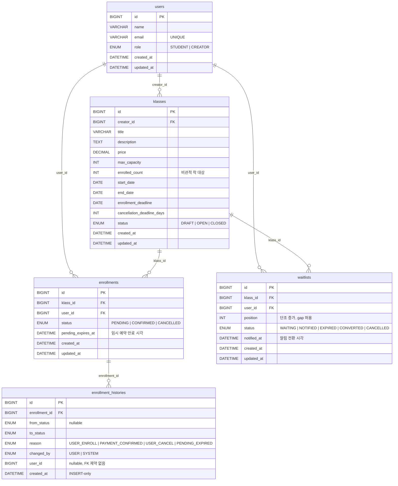
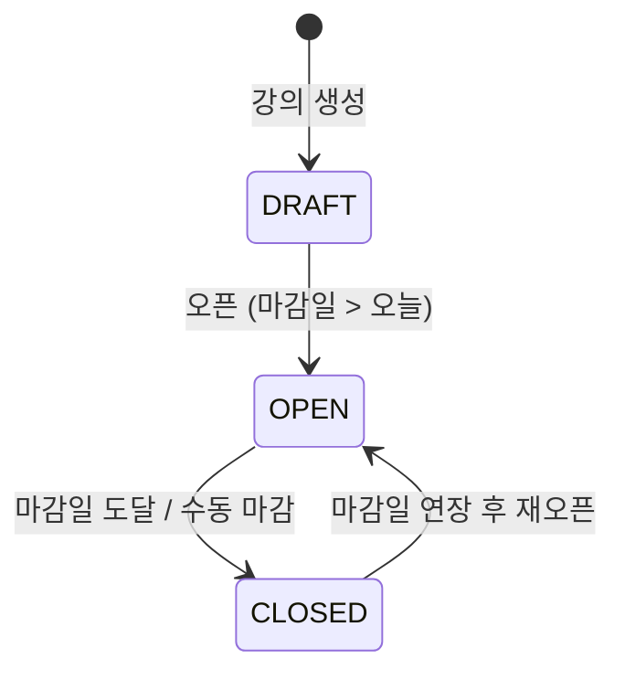
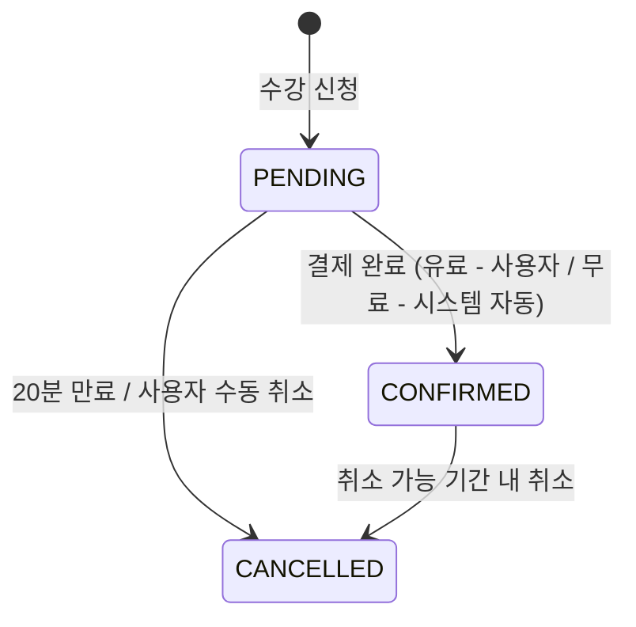
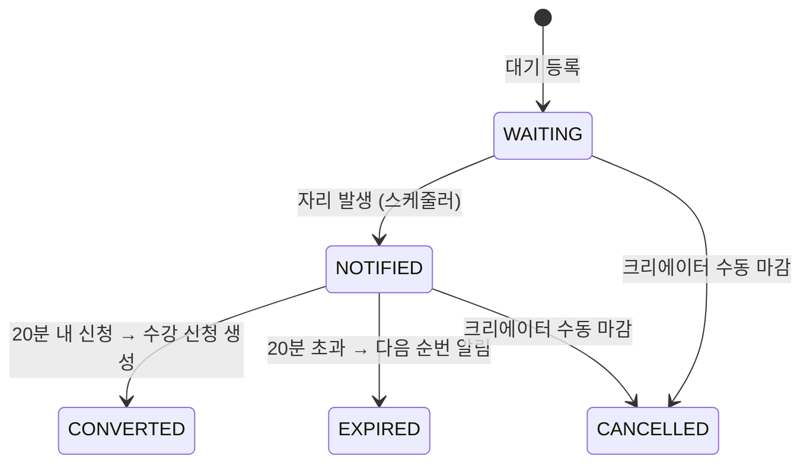

# 수강 신청 시스템 - ERD

## 관계 다이어그램

---

## 테이블 정의

### users

| 컬럼 | 타입 | 제약 | 설명 |
|------|------|------|------|
| id | BIGINT | PK, AUTO_INCREMENT | |
| name | VARCHAR(20) | NOT NULL | |
| email | VARCHAR(255) | NOT NULL, UNIQUE | |
| role | ENUM('STUDENT', 'CREATOR') | NOT NULL, DEFAULT 'STUDENT' | 승격 가능 |
| created_at | DATETIME | NOT NULL | |
| updated_at | DATETIME | NOT NULL | |

### klasses

| 컬럼 | 타입 | 제약 | 설명 |
|------|------|------|------|
| id | BIGINT | PK, AUTO_INCREMENT | |
| creator_id | BIGINT | NOT NULL, FK → users.id | |
| title | VARCHAR(255) | NOT NULL | |
| description | TEXT | | |
| price | DECIMAL(10, 2) | NOT NULL | 0이면 무료 강의 |
| max_capacity | INT | NOT NULL | 최소 1 |
| enrolled_count | INT | NOT NULL, DEFAULT 0 | 비관적 락 대상 |
| start_date | DATE | NOT NULL | |
| end_date | DATE | NOT NULL | start_date 이후 |
| enrollment_deadline | DATE | NOT NULL | start_date 이전 |
| cancellation_deadline_days | INT | NOT NULL | 0이면 취소 불가 |
| status | ENUM('DRAFT', 'OPEN', 'CLOSED') | NOT NULL, DEFAULT 'DRAFT' | |
| created_at | DATETIME | NOT NULL | |
| updated_at | DATETIME | NOT NULL | |

**인덱스**
- `idx_klasses_status` — status
- `idx_klasses_enrollment_deadline` — enrollment_deadline

### enrollments

| 컬럼 | 타입 | 제약 | 설명 |
|------|------|------|------|
| id | BIGINT | PK, AUTO_INCREMENT | |
| klass_id | BIGINT | NOT NULL, FK → klasses.id | |
| user_id | BIGINT | NOT NULL, FK → users.id | |
| status | ENUM('PENDING', 'CONFIRMED', 'CANCELLED') | NOT NULL | |
| pending_expires_at | DATETIME | NULL | PENDING일 때만 유효 |
| created_at | DATETIME | NOT NULL | |
| updated_at | DATETIME | NOT NULL | |

**중복 방지**: DB UNIQUE 제약 미적용 (취소 후 재신청 허용). 애플리케이션에서 PENDING / CONFIRMED 상태 존재 여부를 확인해 409 반환.

**인덱스**
- `idx_enrollments_klass_user` — (klass_id, user_id)
- `idx_enrollments_status_expires` — (status, pending_expires_at)

### waitlists

| 컬럼 | 타입 | 제약 | 설명 |
|------|------|------|------|
| id | BIGINT | PK, AUTO_INCREMENT | |
| klass_id | BIGINT | NOT NULL, FK → klasses.id | |
| user_id | BIGINT | NOT NULL, FK → users.id | |
| position | INT | NOT NULL | 입장 순서 (단조 증가, gap 허용) |
| status | ENUM('WAITING', 'NOTIFIED', 'EXPIRED', 'CONVERTED', 'CANCELLED') | NOT NULL | |
| notified_at | DATETIME | NULL | 알림 전환 시각 (20분 수락 시간 계산 기준) |
| created_at | DATETIME | NOT NULL | |
| updated_at | DATETIME | NOT NULL | |

**position 채번**: `SELECT COALESCE(MAX(position), 0) + 1 FROM waitlists WHERE klass_id = ?` — 반드시 비관적 락 범위 내에서 실행. 취소·만료로 중간 position이 빠져도 재정렬하지 않음.

**인덱스**
- `idx_waitlists_klass_position` — (klass_id, position)
- `idx_waitlists_klass_user` — (klass_id, user_id)
- `idx_waitlists_status_notified` — (status, notified_at)

### enrollment_histories

| 컬럼 | 타입 | 제약 | 설명 |
|------|------|------|------|
| id | BIGINT | PK, AUTO_INCREMENT | |
| enrollment_id | BIGINT | NOT NULL, FK → enrollments.id | |
| from_status | ENUM('PENDING', 'CONFIRMED', 'CANCELLED') | NULL | 최초 신청 시 null |
| to_status | ENUM('PENDING', 'CONFIRMED', 'CANCELLED') | NOT NULL | |
| reason | ENUM('USER_ENROLL', 'PAYMENT_CONFIRMED', 'USER_CANCEL', 'PENDING_EXPIRED') | NOT NULL | |
| changed_by | ENUM('USER', 'SYSTEM') | NOT NULL | |
| user_id | BIGINT | NULL | SYSTEM 처리 시 null, FK 제약 없음 |
| created_at | DATETIME | NOT NULL | INSERT-only |

**인덱스**
- `idx_histories_enrollment_id` — enrollment_id

---

## 상태 전이 다이어그램

### 강의 (Klass)

### 수강 신청 (Enrollment)

### 대기열 (Waitlist)

